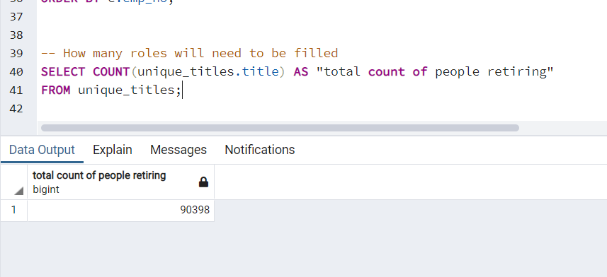
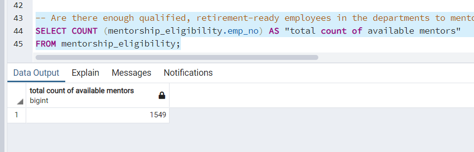

# Pewlett_Hackard

## Overview of the Analysis
Pewlett Hackard is a large company that has been around for a very long time. As baby boomers retire from the company, the company is planning retirement packages and also planning for the future as upcoming retirement will leave thousands of job openings. Planning for this large departure is very important as unfilled vacancies would mean a large gap in the workforce which would put a lot of burden on Human Resources and current employees and could affect company performance. Therefore, we want to use SQL databases through Postgres SQL to find out how many employees will be retiring in the next few years and also how many vacancies will need to be filled. This analysis will help us determine which employees are eligible for retirement, which of the ones retiring are part of the management team, which vacancies will be empty and we will also create a mentorship program to train current employees to fill the role of employees retiring. Pewlett Hackard was previously using Excel and VBA but now they want to transition into SQL. Using relational database is a huge upgrade as it allows us to link different tables, filter data and create new tables, which makes our analysis much easier. 

## Results 
* We joined the employees and titles table and filtered by birth days between 1952 to 1955 to find out who is retiring and their title
* We found the employees most recent title and finally we counted all people retiring by title to find number of people retiring in each title
* For the mentorship program, we created an eligibility table by getting employee information from employees, titles, and dept_employee 
* We filtered the elibility table to choose current employees born in 1965 to help mentor the upcoming employees for the retiring titles

## Summary 
In the initial analysis we played around with the data, you can see these queries in the queries.sql file. We determined retirement eligbility as those who were born in 1951 to 1955 and hired between 1985 to 1988. We conducted a few joins to give us an idea how to join tables. We created the retirement_info and joined it with the dept_employee table in order to get the list of employees retiring who are still at the company. We got a count of employees retiring by their departments, which will help us find out the shortfall of employees by their department and vacancies after these employees retire. We also found other information of retiring employees such as their gender and salary. We also created a list of department managers who are retiring. Afterwards we conducted our main analysis which can be found in employee_database_challenge.sql file. In this analysis, we first created a table of employees retiring and their titles. However, since people have been promoted within the company, we need employees most recent title so we create a table called unique_titles to reflect people's most recent titles, and helps ensure the same employee number doesn't appear multiple times. Finally, we count up all employees retiring and group them by title which helps us count up all employees retiring for each title. This will help give HR an idea for the all the new vacancies that will soon be available once these employees retire. In our last query we create a mentorship eligibility table of employee information with their title and filters to only those employees born in the year 1965 and are currently employed at the company, which is the eligibility requirement for the mentorship program.

There are a few questions that are very important to our analysis:

### How many roles will need to be filled as the "silver tsunami" begins to make an impact?

We run a new query in the image above to count the number of titles in unique_titles table which is the table of all employees retiring by their title. This gives us a total of 90,398 people retiring, indeed a very large number of baby boomers retiring. Therefore, all of 90,398 of these roles will need to be filled in order to ensure a smooth transition and make sure there are no consequences of the silver tsunami.

### Are there enough qualified, retirement-ready employees in the departments to mentor the next generation of Pewlett Hackard employees?

As the image above shows, there are only 1549 mentors available in the departments to mentor Pewlett Hackard employees. If we do some simple math, we find that 90,398/1549 is approximately 58. This means that if we hire new people one retirement ready employee would have to mentor 58 people, which is a very alarming ratio as it would be increasingly difficult for one retirement ready employee to mentor 58 people. The silver tsunami is likely to have serious consequences if Pewlett Hackard does not find a solution to its shortage of trainers. The company could seek more skilled labor that needs less training, but it would also have to pay them more. It could also outsource the training, but there is no guarantee the quality of training will be up to the mark of the standards at Pewlett Hackard. Either way, the company will have to devote a large amount of time and resources to prepare for the silver tsunami. 
